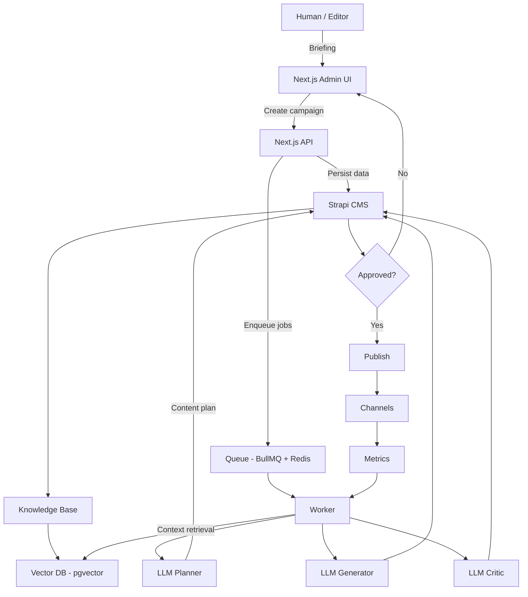

# 🧠 LLM Content Factory

**LLM Content Factory** is an open-source platform for **content automation with quality control**.

It combines **LLMs, workflows, and a CMS** to automate content creation while keeping:

* editorial consistency
* human oversight
* traceability
* learning from real metrics

This is **not** a “generate text with AI” tool.
It is a **content production system**.

---

## ✨ What this project is (and is not)

### ✅ What it is

* A workflow-driven content automation platform
* LLMs acting as **planner, generator, and critic**
* CMS-backed, auditable, and versioned
* Designed for scale and real teams

### ❌ What it is not

* A prompt playground
* A no-review auto-publisher
* A single-script AI toy
* A black box

---

## 🎯 Goals

* Automate multi-channel content production (blog, email, social, ads, docs)
* Enforce brand and quality guardrails
* Reduce manual operational work
* Learn from performance data over time

LLMs are used as **engines**, not as a single source of truth.

---

## 🧩 High-level architecture

### Core stack

* **Next.js** → Admin UI & APIs
* **Strapi** → Editorial CMS & source of truth
* **Node Workers** → Async orchestration
* **OpenAI** → LLMs & embeddings
* **Postgres + pgvector** → Data & RAG
* **Redis + BullMQ** → Job queues

### Simplified flow

```
Editor → Admin UI → API → Queue
     → Worker → LLMs
     → CMS → Publish
     → Metrics → Feedback loop
```

---

## 🗺 Big Picture



---

## ✨ Features

* 📋 Automated content planning
* ✍️ Multi-channel generation
* 🧪 A/B variations
* 🧐 Automated review & scoring
* 🧱 Retrieval-Augmented Generation (RAG)
* 🗓 Scheduling & publishing
* 📊 Metrics-driven feedback loop
* 🧍 Human approval (optional, recommended)

---

## 🧠 Core concepts

### Campaign

A logical group of content with:

* goal
* persona
* channels
* lifecycle status

### Content Task

A single unit of work:

* e.g. SEO article, email, social post

### Content Version

A generated version with:

* revision history
* quality score
* approval status

### Knowledge Base (RAG)

Documents such as:

* brand guidelines
* product docs
* FAQs
* policies

Indexed for semantic retrieval.

---

## 🛡 Design guardrails

This project **does not blindly trust LLMs**.

* ❌ No source → flagged
* ❌ Brand violations → rejected
* ❌ Generic marketing language → penalized
* ✅ Prompt & response logging
* ✅ Explicit quality scoring

---

## 📦 Repository structure

```
.
├── apps/
│   ├── web/        # Next.js admin & APIs
│   ├── cms/        # Strapi CMS
│   └── worker/     # Background jobs & orchestration
│
├── packages/
│   └── shared/     # Shared types, schemas, utilities
│
├── infra/
│   ├── docker/     # Docker Compose setup
│   └── migrations/# Database migrations
│
├── Makefile        # Project interface
└── README.md
```

---

## 🧰 Getting started (local development)

This project uses **Docker + Makefile** as the primary interface.

### Requirements

* Docker & Docker Compose
* Node.js 18+
* Make

### One-command setup

```bash
make dev
```

This will:

1. Start Redis, Postgres, Strapi, Worker, and Web
2. Run database migrations
3. Expose the local environment

### Local URLs

* Admin UI: [http://localhost:3000/admin](http://localhost:3000/admin)
* Strapi Admin: [http://localhost:1337/admin](http://localhost:1337/admin)

---

## 🧱 Useful Makefile commands

```bash
make infra-up        # Start containers
make infra-down      # Stop containers
make infra-logs      # Tail logs
make migrate         # Run DB migrations
make web             # Run web locally
make worker          # Run worker locally
make cms             # Run CMS locally
make reset           # Remove containers and volumes (destructive)
```

---

## 🧪 Main background jobs

* `plan_campaign`
* `generate_task`
* `review_content`
* `adapt_channels`
* `index_knowledge_docs`
* `publish_content`

---

## 📊 Metrics & learning

The system tracks:

* CTR
* Engagement
* Conversion
* Performance by channel
* Performance by title/CTA

All metrics are linked to a specific content version.

---

## ⚠️ Known limitations

* Human review is still required for sensitive content
* RAG quality depends on the knowledge base
* LLMs can fail — that’s why critics and logs exist

---

## 🛣 Roadmap

* [ ] Semantic reranking for RAG
* [ ] Prompt editor UI
* [ ] Automatic title benchmarking
* [ ] Per-tenant policy rules
* [ ] Optional fine-tuning

---

## 🤝 Contributing

Contributions are welcome.

Typical ways to contribute:

* Improve prompts and critics
* Add new jobs or workflows
* Improve observability
* Fix bugs or edge cases
* Improve documentation

Please:

* keep changes focused
* document architectural decisions
* avoid introducing hidden magic

---

## 📄 License

This project is licensed under the **MIT License**.

---

## 🧠 Philosophy

> LLMs are not authors.
> They are fast, tireless assistants.
> Systems, process, and metrics keep them useful.

