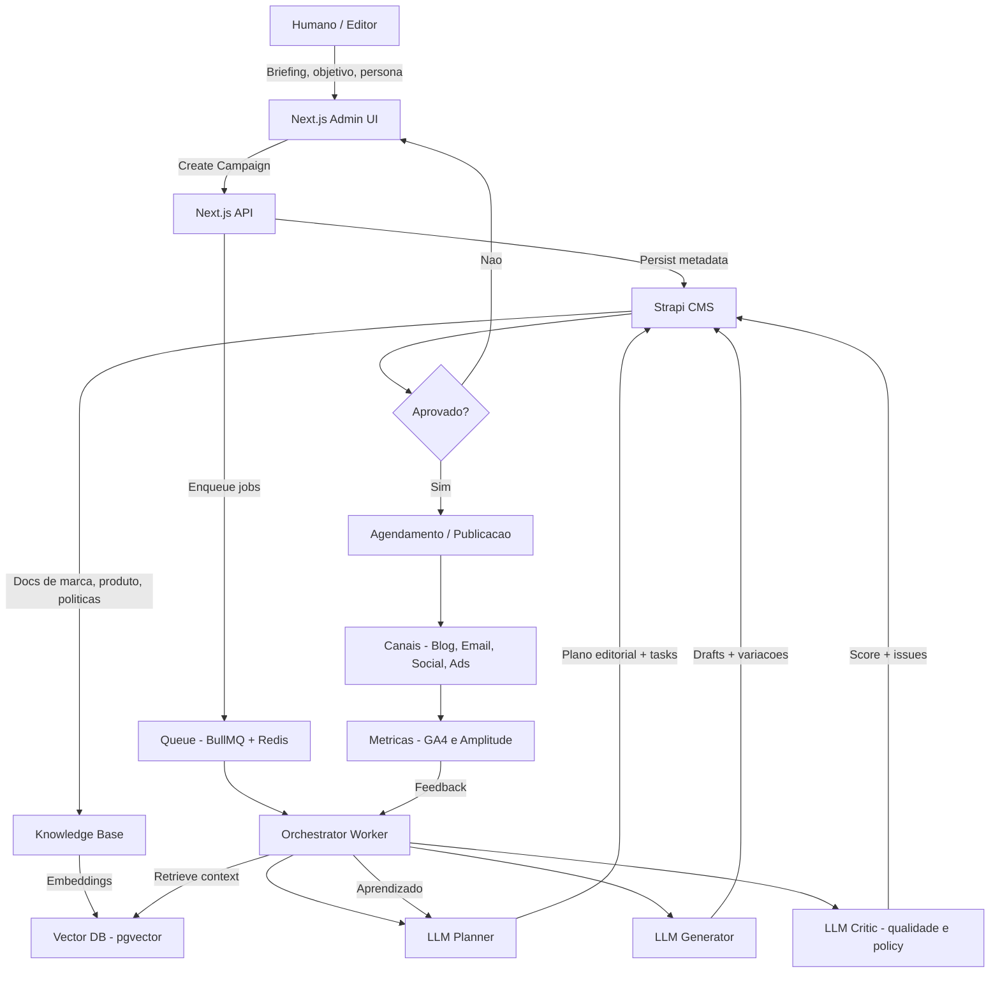

# 🧠 LLM Content Factory

Plataforma de automação de conteúdo usando **LLMs + workflows + CMS**, focada em **qualidade, escala e controle humano**.

Não é só “gerar texto com IA”.
É **planejar, gerar, revisar, publicar e aprender** com dados reais.

---

## 🎯 Objetivo

Automatizar a produção de conteúdo multi-canal (blog, email, social, ads, docs) garantindo:

* Consistência de marca
* Qualidade editorial
* Redução de trabalho manual
* Aprendizado contínuo via métricas

Com **LLM como motor**, não como cérebro único.

---

## 🧩 Visão geral da arquitetura

**Stack principal:**

* **Next.js** → Admin UI + APIs
* **Strapi** → CMS e fonte de verdade editorial
* **Node Workers** → Orquestração e jobs
* **OpenAI** → LLM + embeddings
* **Postgres + pgvector** → Dados + RAG
* **Redis + BullMQ** → Filas e jobs assíncronos

Fluxo resumido:

```
Editor → Next Admin → API → Queue
     → Orchestrator → LLMs
     → Strapi → Publicação
     → Métricas → Feedback Loop
```

## 🗺 Big Picture



---

## ✨ Principais features

* 📋 **Planejamento automático de conteúdo**
* ✍️ **Geração multi-canal (1 ideia → N formatos)**
* 🧪 **Variações A/B**
* 🧐 **Revisão automática (LLM Critic)**
* 🧱 **RAG com base de conhecimento**
* 🗓 **Agendamento e publicação**
* 📊 **Feedback loop com métricas**
* 🧍 **Aprovação humana opcional (mas recomendada)**

---

## 🧠 Conceitos importantes

### Campaign

Agrupador de conteúdo com:

* objetivo
* persona
* canais
* status

### Content Task

Uma unidade de trabalho:

* ex: “Post SEO”, “Thread LinkedIn”, “Email”

### Content Version

Versões geradas de um conteúdo (com histórico e score).

### Knowledge Base (RAG)

Documentos de:

* marca
* produto
* FAQs
* políticas
  Indexados em vetor para reduzir alucinação.

---

## 🛡 Guardrails (por design)

Este projeto **não confia cegamente no LLM**.

* ❌ Conteúdo sem fonte → marcado
* ❌ Violação de tom/marca → reprovado
* ❌ Linguagem genérica (“revolucionário”, “líder de mercado”) → penalizada
* ✅ Logs de prompts e respostas
* ✅ Score de qualidade por versão

---

## 📦 Estrutura do repositório

```
.
├── apps/
│   ├── web/          # Next.js (Admin + APIs)
│   ├── cms/          # Strapi
│   └── worker/       # Orchestrator + BullMQ
│
├── packages/
│   └── shared/       # Tipos, schemas, clients
│
├── infra/
│   ├── docker/       # Postgres, Redis
│   └── migrations/
│
└── README.md
```

---

## 🔄 Fluxo de funcionamento

1. Editor cria uma **Campaign** no Admin
2. API cria o draft no Strapi
3. Job é enfileirado (BullMQ)
4. Orchestrator executa:

   * Planner → Generator → Critic
5. Conteúdo é salvo como:

   * `needs_review` ou `ready`
6. Editor aprova (opcional)
7. Strapi publica ou agenda
8. Métricas retornam para o sistema
9. Próximos conteúdos melhoram 📈

---

## 🧪 Jobs principais

* `plan_campaign`
* `generate_task`
* `review_content`
* `adapt_channels`
* `index_knowledge_docs`
* `publish_content`

---

## 📊 Métricas coletadas

* CTR
* Engajamento
* Conversão
* Performance por título / CTA
* Performance por canal

Tudo associado a um `contentVersionId`.

---

## 🚀 Como rodar localmente (resumo)

```bash
# Infra
docker compose up -d postgres redis

# CMS
cd apps/cms
yarn develop

# Worker
cd apps/worker
yarn dev

# Web
cd apps/web
yarn dev
```

> Requisitos: Node 18+, Docker, Redis

---

## ⚠️ Limitações conhecidas

* Não substitui revisão humana em conteúdo sensível
* RAG depende da qualidade da base
* LLM pode errar — por isso existe o Critic 😌

---

## 🛣 Roadmap (curto)

* [ ] Rerank semântico nos resultados do RAG
* [ ] Editor visual de prompts
* [ ] Benchmark automático de títulos
* [ ] Custom policies por cliente
* [ ] Fine-tuning opcional por domínio

---

## 🧠 Filosofia do projeto

> IA não é autora.
> É estagiária rápida, incansável e meio atrevida.
> Por isso tem processo, revisão e métrica.

---

Se quiser, no próximo passo eu posso:

* adaptar o README para **open-source**
* escrever uma versão **mais “enterprise”**
* ou criar um **README técnico + README de produto**

